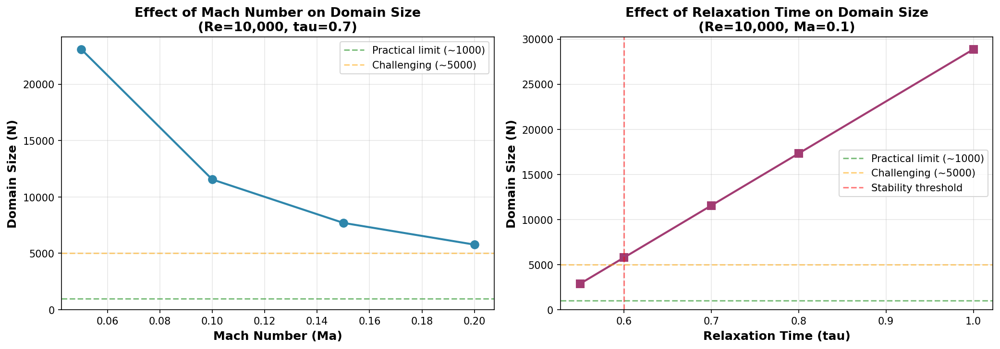

# Dimensionless Scaling for LBM Simulations

## Overview

This guide explains how to properly scale LBM simulations to achieve high Reynolds numbers while maintaining numerical stability. The key insight is that LBM has constraints on velocity and relaxation time, but freedom in domain size and physical scaling.

## The Problem

In Lattice Boltzmann Method (LBM), we face fundamental constraints:

1. **Mach number constraint**: `Ma = u_lattice / c_s < 0.3` (ideally < 0.2)
2. **Relaxation time constraint**: `tau > 0.5` (ideally > 0.6 for stability)

Where `c_s = 1/√3 ≈ 0.577` in lattice units.

These constraints mean:
- **Maximum stable lattice velocity**: `u_lattice < 0.173` (for Ma < 0.3)
- **Minimum relaxation time**: `tau > 0.5`

## The Solution: Dimensionless Scaling

### Key Insight

While velocity and tau are constrained, we have **freedom** to adjust:
- **Domain size N** (number of lattice nodes)
- **Grid spacing dx**
- **Time step dt**

These can be chosen to achieve any target Reynolds number!

### Fundamental Relations

The Reynolds number in lattice units is:

```
Re = (u_lattice * N) / ν_lattice
```

Where:
- `u_lattice` is the lattice velocity
- `N` is the domain size (in lattice units)
- `ν_lattice` is the lattice kinematic viscosity

And the lattice viscosity relates to relaxation time:

```
ν_lattice = (tau - 0.5) / 3
```

### Strategy for High Reynolds Numbers

Given a target Reynolds number, we can solve for N:

```
N = Re * ν_lattice / u_lattice
  = Re * (tau - 0.5) / (3 * u_lattice)
  = Re * (tau - 0.5) / (3 * Ma * c_s)
```

**Example:** For Re = 10,000 with Ma = 0.1 and tau = 0.7:

```
N = 10,000 * (0.7 - 0.5) / (3 * 0.1 * 0.577)
  = 10,000 * 0.2 / 0.173
  = 11,548 lattice units
```

## Using the DimensionlessScaling Class

### Basic Usage

```python
from lbm_cht.lbm.unit_converter import DimensionlessScaling

# Physical parameters
u_phys = 1.0  # m/s
L_phys = 0.01  # m (characteristic length)
nu_phys = 1.0e-6  # m²/s (water)

# Calculate physical Re
Re_phys = u_phys * L_phys / nu_phys  # = 10,000

# Create scaling
scaling = DimensionlessScaling(
    Re_target=Re_phys,
    L_ref=L_phys,
    u_ref=u_phys,
    nu_ref=nu_phys,
    Ma_target=0.1,  # Target Mach number
    tau_target=0.7   # Target relaxation time
)

# Get lattice parameters
print(f"Domain size: N = {scaling.N}")
print(f"Grid spacing: dx = {scaling.dx}")
print(f"Time step: dt = {scaling.dt}")
print(f"Lattice velocity: u = {scaling.u_lattice}")
```

### Output

```
============================================================
DIMENSIONLESS SCALING SUMMARY
============================================================

PHYSICAL PARAMETERS:
  Reference length:     L = 0.010000 m
  Reference velocity:   u = 1.000000 m/s
  Kinematic viscosity:  ν = 1.000000e-06 m²/s
  Target Reynolds:     Re = 10000

LATTICE PARAMETERS:
  Domain size:          N = 11548 lattice units
  Lattice velocity:     u = 0.057735 (Ma = 0.100)
  Lattice viscosity:    ν = 0.066667
  Relaxation time:    tau = 0.700
  Actual Reynolds:     Re = 10000.9

SCALING FACTORS:
  Grid spacing:        dx = 8.659508e-07 m
  Time step:           dt = 8.659508e-07 s

STABILITY CHECKS:
  Mach number < 0.3:     ✓ (Ma = 0.100)
  Tau > 0.6:             ✓ (tau = 0.700)
  Re matches target:     ✓ (target=10000, actual=10000.9)
============================================================
```

## Parameter Selection Guidelines

### Reynolds Number Ranges

| Reynolds Range | Difficulty | Recommended Parameters |
|----------------|------------|------------------------|
| Re < 1,000 | Easy | Ma = 0.05-0.1, tau = 0.7-1.0 |
| 1,000 - 10,000 | Moderate | Ma = 0.1-0.15, tau = 0.65-0.7 |
| 10,000 - 50,000 | Challenging | Ma = 0.15-0.2, tau = 0.6-0.65 |
| Re > 50,000 | Very Difficult | Special techniques required |

### Mach Number Selection

| Ma Range | Stability | Domain Size | Use Case |
|----------|-----------|-------------|----------|
| 0.05-0.1 | Excellent | Large | Conservative, high accuracy |
| 0.1-0.15 | Good | Moderate | Balanced |
| 0.15-0.2 | Fair | Small | Aggressive, need to monitor |
| > 0.2 | Poor | Smallest | Risk of compressibility errors |

### Relaxation Time Selection

| tau Range | Stability | Domain Size | Use Case |
|-----------|-----------|-------------|----------|
| 0.7-1.0 | Excellent | Large | Very stable |
| 0.6-0.7 | Good | Moderate | Stable, practical |
| 0.55-0.6 | Fair | Small | Marginal, watch for issues |
| < 0.55 | Poor | Smallest | Numerically unstable |

## Trade-offs Visualization



**Left plot:** Effect of Mach number on domain size
- Higher Ma → Smaller domain size
- But reduced stability margin

**Right plot:** Effect of relaxation time on domain size  
- Lower tau → Smaller domain size
- But tau must stay above 0.6 for stability

## Practical Examples

### Example 1: Moderate Reynolds (Re = 1,000)

```python
scaling = DimensionlessScaling(
    Re_target=1000,
    L_ref=0.01,      # 10 mm
    u_ref=0.1,       # 0.1 m/s
    nu_ref=1e-6,     # Water
    Ma_target=0.1,
    tau_target=0.7
)
# Result: N ≈ 1,155 (practical!)
```

### Example 2: High Reynolds (Re = 10,000)

```python
scaling = DimensionlessScaling(
    Re_target=10000,
    L_ref=0.01,
    u_ref=1.0,
    nu_ref=1e-6,
    Ma_target=0.1,
    tau_target=0.7
)
# Result: N ≈ 11,548 (large but doable)
```

### Example 3: Very High Reynolds (Re = 100,000)

**Conservative approach:**
```python
scaling = DimensionlessScaling(
    Re_target=100000,
    L_ref=0.01,
    u_ref=10.0,
    nu_ref=1e-6,
    Ma_target=0.1,
    tau_target=0.7
)
# Result: N ≈ 115,478 (impractical!)
```

**Aggressive approach:**
```python
scaling = DimensionlessScaling(
    Re_target=100000,
    L_ref=0.01,
    u_ref=10.0,
    nu_ref=1e-6,
    Ma_target=0.2,   # Higher Ma
    tau_target=0.6   # Lower tau
)
# Result: N ≈ 28,870 (more practical, but less stable)
```

## Workflow

### Step-by-Step Process

1. **Define physical problem:**
   - Velocity: `u_phys` (m/s)
   - Length scale: `L_phys` (m)
   - Viscosity: `nu_phys` (m²/s)
   - Calculate: `Re_phys = u_phys * L_phys / nu_phys`

2. **Choose target parameters:**
   - Start with `Ma = 0.1` (conservative)
   - Start with `tau = 0.7` (stable)

3. **Create scaling:**
   ```python
   scaling = DimensionlessScaling(Re_phys, L_phys, u_phys, nu_phys, 
                                   Ma_target=0.1, tau_target=0.7)
   ```

4. **Check domain size:**
   - If `N < 1000`: Excellent! ✓
   - If `1000 < N < 5000`: Good, but large
   - If `N > 5000`: Too large, need to adjust

5. **Adjust if needed:**
   - Increase `Ma_target` to 0.15 or 0.2
   - Decrease `tau_target` to 0.65 or 0.6
   - Re-create scaling and check again

6. **Validate stability:**
   - Run short test simulation
   - Check for NaN/Inf
   - Monitor max velocity
   - Adjust parameters if unstable

## Unit Conversions

The `DimensionlessScaling` class provides conversion methods:

### Length Conversions

```python
# Physical to lattice
N_lattice = scaling.physical_to_lattice_length(L_phys)

# Lattice to physical  
L_phys = scaling.lattice_to_physical_length(N_lattice)
```

### Velocity Conversions

```python
# Physical to lattice
u_lattice = scaling.physical_to_lattice_velocity(u_phys)

# Lattice to physical
u_phys = scaling.lattice_to_physical_velocity(u_lattice)
```

### Time Conversions

```python
# Physical to lattice steps
n_steps = scaling.physical_to_lattice_time(t_phys)

# Lattice steps to physical
t_phys = scaling.lattice_to_physical_time(n_steps)
```

## Common Issues and Solutions

### Issue 1: Domain Too Large

**Problem:** Required N > 10,000

**Solutions:**
1. Increase Ma from 0.1 to 0.15 or 0.2
2. Decrease tau from 0.7 to 0.65 or 0.6
3. Reduce physical Reynolds number (if possible)
4. Consider coarser resolution (trade accuracy for speed)

### Issue 2: Simulation Unstable

**Problem:** NaN/Inf values appear

**Solutions:**
1. Decrease Ma (e.g., from 0.2 to 0.1)
2. Increase tau (e.g., from 0.6 to 0.7)
3. Check initial conditions (avoid discontinuities)
4. Reduce time step (if manually set)

### Issue 3: Reynolds Number Mismatch

**Problem:** Actual Re differs from target

**Solutions:**
1. Check that physical parameters match design
2. Verify material properties are correct
3. Use auto-calculated dt for consistency
4. Check that boundary conditions preserve mass flow

## Advanced Topics

### Multiple Length Scales

For problems with multiple length scales (e.g., diameter and length):

```python
# Scale based on diameter
scaling = DimensionlessScaling(
    Re_target=Re_D,
    L_ref=D,  # Diameter
    u_ref=u_bulk,
    nu_ref=nu,
    Ma_target=0.1,
    tau_target=0.7
)

# Calculate aspect ratios
aspect_ratio = L_pipe / D  # e.g., 10:1

# Get grid dimensions
nx = int(scaling.N * aspect_ratio)  # Length direction
ny = nz = scaling.N  # Diameter directions
```

### Thermal Scaling (Prandtl Number)

For heat transfer, Prandtl number must also be preserved:

```python
Pr = nu / alpha  # Prandtl number

# In lattice units, this determines thermal tau:
tau_thermal = 0.5 + 3 * alpha * dt / dx²
            = 0.5 + (tau_momentum - 0.5) / Pr
```

The solver automatically handles this through material properties.

### High Re Strategies

For Re > 50,000:
1. **Increase Ma and decrease tau** to practical N
2. **Use turbulence models** (LES, DES)
3. **Wall functions** to reduce near-wall resolution
4. **Adaptive mesh refinement** (if available)
5. **Parallel computing** for large domains

## References

1. **LBM Theory:**
   - Krüger et al., "The Lattice Boltzmann Method: Principles and Practice" (2017)
   - Succi, "The Lattice Boltzmann Equation for Fluid Dynamics and Beyond" (2001)

2. **Dimensionless Numbers:**
   - Reynolds number: Re = uL/ν
   - Mach number: Ma = u/c_s
   - Prandtl number: Pr = ν/α

3. **Stability:**
   - BGK approximation requires tau > 0.5
   - Compressibility errors for Ma > 0.3
   - Viscosity: ν = (tau - 0.5)/3 in lattice units

## Summary

**Key Takeaways:**

1. ✅ Reynolds number can be achieved through domain size N
2. ✅ Mach number and tau control lattice velocity and viscosity
3. ✅ Trade-off: Higher Ma or lower tau → smaller N but less stable
4. ✅ Use `DimensionlessScaling` class to automatically calculate parameters
5. ✅ Start conservative (Ma=0.1, tau=0.7), adjust if N too large
6. ✅ Always validate stability with test runs

**Quick Reference:**

```python
from lbm_cht.lbm.unit_converter import DimensionlessScaling

scaling = DimensionlessScaling(
    Re_target=10000,    # Target Reynolds number
    L_ref=0.01,         # Characteristic length (m)
    u_ref=1.0,          # Characteristic velocity (m/s)
    nu_ref=1e-6,        # Kinematic viscosity (m²/s)
    Ma_target=0.1,      # Target Mach number
    tau_target=0.7      # Target relaxation time
)

# Use scaling.N, scaling.dx, scaling.dt in your simulation
```

This approach enables simulations at realistic Reynolds numbers while maintaining LBM stability!
